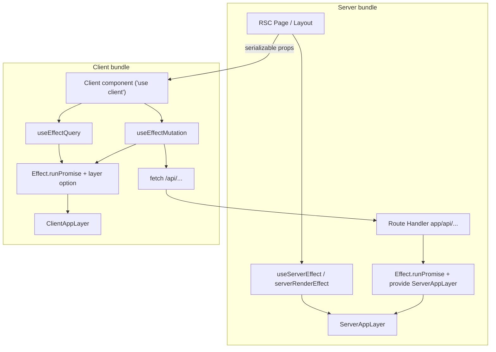

# Effect.ts + React Skill

## Purpose

This skill describes the **target architecture** for React applications that use Effect.ts with Next.js App Router and **`@idclear/effect-react`**. It covers where Effects run, how server and client layers stay separate, and how UI code stays type-safe without leaking server dependencies into the browser bundle.

**Use this skill when**: Building or refactoring RSC pages, client components, API route handlers, or feature folders that combine React with Effect programs.

**Prerequisites** (read first):

- `effect.ts-fundamentals` — `Effect.gen`, `pipe`, Schema
- `effect.ts-architect` — Tags, Layers, services, errors
- `effect.ts-testing` — Layer-based tests (never `vi.mock` Effect services)

**Canonical library**: `@idclear/effect-react` (`libs/effect-react`) — hooks and SSR helpers. This is the project's React integration; do not assume a separate npm `@effect/react` package.

---

## Core philosophy

1. **Effects describe work; boundaries execute them** — Server RSC, route handlers, and client hooks each call `Effect.runPromise` with the correct `Layer`.
2. **Symmetric semantics, different React shapes** — Server components may be `async` and `await` an Effect; client components are **sync** and use hooks (`useEffectQuery`, `useEffectMutation`) because React forbids `async` client components.
3. **Two layer graphs** — `ServerAppLayer` and `ClientAppLayer` share **Tags** and domain types, not **Live** implementations.
4. **Client mutations go through API routes** — Browser code uses `useEffectMutation` + `fetch` (or a thin HTTP client service), not server actions, so secrets and server-only deps never ship to the client.

---

## Architecture



---

## Hard rules

### Never

- ❌ `async function` on a module marked `'use client'` (Next.js / React will error)
- ❌ Import `ServerAppLayer`, `*ServerLive`, `next/headers`, `cookies()`, or server-only SDKs inside client components or `ClientAppLayer`
- ❌ Call `Effect.runPromise` bare in event handlers without `ClientAppLayer` (or `layer` option on hooks) when the program has `R ≠ never`
- ❌ Use server actions as the primary mutation path from client UI — use **API routes** + `useEffectMutation`
- ❌ `vi.mock()` / `jest.mock()` on Effect services (see `effect.ts-testing`)

### Always

- ✅ Define service **Tags** in shared modules; put **Live** in `*ServerLive` / `*ClientLive` files
- ✅ Provide `ServerAppLayer` only on the server (RSC, layouts, route handlers)
- ✅ Provide `ClientAppLayer` via hook `layer` option or app-level convention
- ✅ Pass only **JSON-serializable** values from server components to client children
- ✅ Keep domain logic in pure functions or Effect programs that depend on Tags, not on React

---

## Layer split: `ServerAppLayer` vs `ClientAppLayer`

| | ServerAppLayer | ClientAppLayer |
|---|----------------|----------------|
| **Used in** | RSC, layouts, `app/api/**/route.ts` | `'use client'` components (via hooks) |
| **Live impls** | DB, cookies, server Logto, secrets | `fetch`, browser storage, public config |
| **Must not import** | Browser-only APIs | Server-only modules |

### Feature layout

```
features/<feature>/
  domain/                 # pure types + functions, no React, no Live
  application/            # Effect programs (depend on Tags only)
  services/
    Foo.ts                # Context.Tag + interface
    FooServerLive.ts      # server adapter only
    FooClientLive.ts      # browser adapter only
  layers/
    ServerAppLayer.ts     # merge *ServerLive + server deps
    ClientAppLayer.ts     # merge *ClientLive only
  presentation/
    pages/                # async RSC — no 'use client'
    layouts/              # async RSC guards
    components/           # 'use client' + hooks
    serializers/          # wire types for props / API bodies
```

### Composing app layers

```typescript
// layers/ServerAppLayer.ts
import { Layer } from 'effect'
import { AuthServerLayer } from '../features/auth/layers/AuthServerLayer'
import { HttpServerLayer } from '../infrastructure/HttpServerLayer'

export const ServerAppLayer = Layer.mergeAll(
  HttpServerLayer,
  AuthServerLayer,
  // ...
)
```

```typescript
// layers/ClientAppLayer.ts — safe to import from 'use client' modules
import { Layer } from 'effect'
import { HttpClientLive } from '../infrastructure/HttpClientLive'
import { AuthClientLive } from '../features/auth/services/AuthClientLive'

export const ClientAppLayer = Layer.mergeAll(
  HttpClientLive,
  AuthClientLive,
)
```

**Import rule**: If a file has `'use client'`, its transitive imports must not reach `*ServerLive` or `ServerAppLayer`. Enforce with dependency-cruiser or ESLint when possible.

---

## Server: React Server Components

Server components may be `async`. Run Effects with `@idclear/effect-react/ssr`:

```typescript
import { useServerEffect } from '@idclear/effect-react/ssr'
import { Effect } from 'effect'
import { ServerAppLayer } from '@/layers/ServerAppLayer'
import { UserService } from '@/features/users/services/UserService'

export async function UserPage({ userId }: { userId: string }) {
  const user = await useServerEffect(
    Effect.gen(function* () {
      const users = yield* UserService
      return yield* users.getById(userId)
    }).pipe(Effect.provide(ServerAppLayer)),
  )

  return <UserProfile initialUser={user} />
}
```

`useServerEffect` is `serverRenderEffect` — `Effect.runPromise` with errors mapped to `RenderError`. Use it for **initial render data** on the server.

### Redirects and framework errors

When using Next.js `redirect()` / `notFound()` inside `Effect.gen`, use a small Effect wrapper and a boundary helper that re-throws framework control-flow errors (so `runPromise` does not turn them into 500s). Pattern:

```typescript
import { Effect } from 'effect'
import { redirect as nextRedirect } from 'next/navigation'

export const redirect = (href: string): Effect.Effect<void> =>
  Effect.sync(() => nextRedirect(href))
```

At the app boundary, run with `Effect.runPromiseExit`, squash failures, and rethrow known redirect markers.

### Route handlers (`app/api/.../route.ts`)

API routes are the **server execution boundary** for client mutations and fetches:

```typescript
import { Effect } from 'effect'
import { ServerAppLayer } from '@/layers/ServerAppLayer'
import { validateRequest } from '@idclear/effect-schema'
import { SubscribeInputSchema } from '@/features/auth/domain/subscribe-input'

export async function POST(request: Request) {
  const body = await request.json()

  return Effect.runPromise(
    Effect.gen(function* () {
      const input = yield* validateRequest(SubscribeInputSchema, body)
      const client = yield* RiskCalculatorClient
      const result = yield* client.subscribe(input)
      return Response.json(result)
    }).pipe(Effect.provide(ServerAppLayer)),
  ).catch((e) => Response.json({ error: String(e) }, { status: 500 }))
}
```

Keep handlers thin: validate → single application program → JSON response.

---

## Client: hooks (not async components)

Client components stay **synchronous**. Use `@idclear/effect-react` hooks; they call `Effect.runPromise` internally with optional `layer: ClientAppLayer`.

### Server ↔ client symmetry

| Concern | Server (RSC) | Client (`'use client'`) |
|---------|----------------|-------------------------|
| Initial load | `await useServerEffect(program.pipe(Effect.provide(ServerAppLayer)))` | `useEffectQuery(program, { layer: ClientAppLayer, dependencies: [...] })` |
| User mutation | N/A (use route handler) | `useEffectMutation(fn, { layer: ClientAppLayer })` |
| Form submit | N/A | `useEffectFormSubmit(schema, submitEffect, { layer: ClientAppLayer })` |
| Layer | `ServerAppLayer` | `ClientAppLayer` |

### `useEffectQuery` — load and refetch

```typescript
'use client'

import { useEffectQuery } from '@idclear/effect-react'
import { Effect } from 'effect'
import { ClientAppLayer } from '@/layers/ClientAppLayer'
import { ProfileService } from '@/features/auth/services/ProfileService'

export function ProfileList() {
  const { data, loading, error, refetch } = useEffectQuery(
    Effect.gen(function* () {
      const profiles = yield* ProfileService
      return yield* profiles.listForSelection()
    }),
    { layer: ClientAppLayer, dependencies: [] },
  )

  if (loading) return <p>Loading…</p>
  if (error) return <p role="alert">{String(error)}</p>
  return (
    <ul>
      {data?.map((p) => (
        <li key={p.id}>{p.name}</li>
      ))}
    </ul>
  )
}
```

Memoize the Effect if dependencies are stable and construction is expensive (see `@idclear/effect-react` README).

### `useEffectMutation` + API routes

Client mutations **must not** call server actions for Effect-backed work. Call an API route; implement the route with `ServerAppLayer`.

```typescript
'use client'

import { useEffectMutation } from '@idclear/effect-react'
import { Effect } from 'effect'
import { ClientAppLayer } from '@/layers/ClientAppLayer'
import { HttpClient } from '@effect/platform'

export function SubscribeForm({ hash, token, type }: SubscribeFormProps) {
  const { mutate, loading, error } = useEffectMutation(
    (input: SubscribeInput) =>
      Effect.gen(function* () {
        const http = yield* HttpClient.HttpClient
        const response = yield* http.post('/api/subscribe', {
          body: HttpBody.unsafeJson(input),
        })
        if (response.status >= 400) {
          return yield* Effect.fail(new SubscribeError({ status: response.status }))
        }
        return yield* response.json
      }),
    { layer: ClientAppLayer },
  )

  return (
    <form
      onSubmit={(e) => {
        e.preventDefault()
        void mutate({ hash, token, type })
      }}
    >
      <button disabled={loading}>Continue</button>
      {error != null ? <p role="alert">{String(error)}</p> : null}
    </form>
  )
}
```

Prefer a **client HTTP service** Tag (`HttpClientLive` in `ClientAppLayer`) over raw `fetch` scattered in components, so programs stay testable with `effect.ts-testing`.

### Discriminated results from API

When the API returns business failures (409, validation), model JSON as a discriminated union and map in the mutation Effect with `Effect.flatMap` / `Effect.fail` — do not rely on thrown exceptions across the wire.

### `useEffectFormSubmit` — Schema-driven forms

```typescript
import { Schema } from 'effect'
import { useEffectFormSubmit } from '@idclear/effect-react'
import { ClientAppLayer } from '@/layers/ClientAppLayer'

const FormSchema = Schema.Struct({ email: Schema.String, name: Schema.String })

export function RegisterForm() {
  const { form, handleSubmit, loading, error } = useEffectFormSubmit(
    FormSchema,
    (values) => submitRegistration(values), // Effect program, R requires ClientAppLayer
    { layer: ClientAppLayer, defaultValues: { email: '', name: '' } },
  )

  return (
    <form onSubmit={handleSubmit}>
      {/* register fields via form.register('email') etc. */}
      <button disabled={loading}>Submit</button>
      {error != null ? <p role="alert">{String(error)}</p> : null}
    </form>
  )
}
```

Validate on the server again in the route handler with the same Schema (`@idclear/effect-schema` / `Schema.decodeUnknown`).

---

## Serialization boundary

| Crosses boundary | Allowed | Implementation (test-nextjs) |
|------------------|---------|------------------------------|
| RSC → client props | Plain JSON DTO | `toXxxDto(domain)` before props |
| Server action → client | Plain JSON DTO (never `Data.TaggedEnum` instances) | `toXxxDto` in server actions |
| Client after server action | Domain types reconstructed client-side | `fromXxxDto` in `*ClientLive.ts` |
| Client → API body | JSON-serializable DTOs; validate with Schema on both sides | `parseJsonBody` in route handlers |
| Session / graph state | Feature DTO + optional presentation mappers | See `history/test-nextjs-dto-boundaries.md` |

Feature layout for boundary types: `features/<feature>/common/dto/` (`*Dto`, `toXxxDto`, `fromXxxDto`).

Never pass `Effect`, `Layer`, class instances, or server service handles as props.

---

## Application programs (shared)

Put orchestration in `application/` as functions returning `Effect<A, E, R>`:

```typescript
export const loadProfilePage = (id: string) =>
  Effect.gen(function* () {
    const profiles = yield* ProfileService
    const user = yield* profiles.getById(id)
    return { user, canEdit: user.role === 'admin' }
  })
```

- RSC: `yield* loadProfilePage(id)` inside `useServerEffect` + `ServerAppLayer`
- Client refetch: same program in `useEffectQuery` + `ClientAppLayer` **only if** every service in `R` has a client Live (often refetch goes through API instead)

When client and server capabilities differ, split programs: `loadProfilePageServer` vs `loadProfilePageClient`, or keep one program and call HTTP from `ProfileClientLive` only.

---

## Testing

| Layer | Approach |
|-------|----------|
| `application/` programs | `Effect.provide(MockLayer)` + `Effect.runPromise` (see `effect.ts-testing`) |
| Hooks | `@testing-library/react` + `ClientAppLayer` test layer; mock HTTP at service boundary |
| Route handlers | Call `POST(request)` with `Effect.provide(ServerAppLayerTest)` |
| RSC | Unit-test the underlying Effect; integration-test pages sparingly |

---

## Anti-patterns

| Anti-pattern | Why | Instead |
|--------------|-----|---------|
| Server action called from `useEffectMutation` | Couples client to Next server-action protocol; blurs layer boundaries | `POST /api/...` + route handler |
| One `*Live` for both environments | Pulls server code into client bundle | `*ServerLive` / `*ClientLive` |
| `useEffect` + manual `fetch` + `useState` | Loses typed errors, DI, and testability | `useEffectQuery` / `useEffectMutation` |
| Effect programs in every click handler | Repetitive `runPromise` / error handling | Mutation hook or shared `useEffectMutation` |
| Importing `@idclear/frontend/effect` server layers in client | Bundle bleed | Client Live + HTTP to API |
| Async client component | Invalid React | Sync component + hooks |

---

## Checklist for new UI features

1. Define or reuse **Tags** in `services/Foo.ts`.
2. Add **`FooServerLive`** and **`FooClientLive`** (if client needs the capability).
3. Extend **`ServerAppLayer`** and **`ClientAppLayer`**.
4. Add **`application/`** program(s).
5. **RSC page**: `useServerEffect` + props to client.
6. **Client UI**: `useEffectQuery` / `useEffectMutation` with `ClientAppLayer`.
7. **Mutations**: `app/api/.../route.ts` with Schema validation + `ServerAppLayer`.
8. Tests: Layer mocks per `effect.ts-testing`.

---

## Related packages

| Package | Use |
|---------|-----|
| `@idclear/effect-react` | Hooks + `useServerEffect` / `serverRenderEffect` |
| `@idclear/effect-schema` | Request/response Schema validation in API routes |
| `@idclear/effect-services` | Shared errors (`RenderError`, `ValidationError`, etc.) |
| `effect` | Core Effect types and combinators |

For Layer design and service naming, follow `effect.ts-architect`. For test doubles, follow `effect.ts-testing`.
